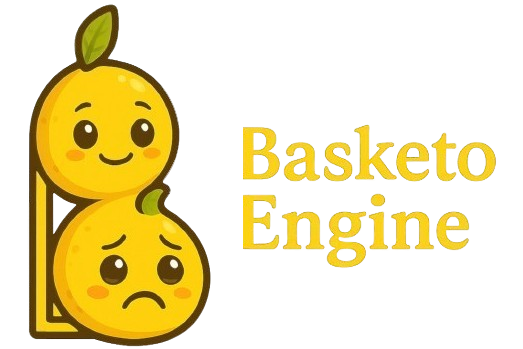

<p align="center">
     <!-- Assuming you have a logo, replace with actual path and alt text -->
</p>

<h1 align="center">Basketo Game Engine</h1>

<div align="center">

[](https://discord.gg/sTM6FPMH) <!-- Replace your_discord_server_id with your actual server ID -->
[](https://github.com/basketoengine/Basketo)

</div>

<p align="center">
Welcome to the Basketo Engine - a passion project where I’m putting my best shot into creating something awesome. Whether you’re here to contribute, suggest ideas, or just watch it grow, you’re part of the journey!
</p>

## Click the below image to see Video
<p align="center">
  <a href="https://x.com/BaslaelWorkneh/status/1922713614697288096">
    
  </a>
</p>

## Building the Engine (Linux)

### Prerequisites
- CMake 3.26.0 or higher is required.
- SDL2, SDL2_image, SDL2_ttf, SDL2_mixer
- Lua 5.4
- g++ (C++17)

### Build Steps
```bash
# Clone the repository
git clone --recurse-submodules git@github.com:basketoengine/Basketo.git

cd Basketo

mkdir build && cd build

cmake ..

make -j$(nproc)

```

### Running
```bash
./BasketoGameEngine

```

If you want to run the physics test:
```bash
./PhysicsTest

```

## Building the Engine (Windows)

### Prerequisites

1. **Visual Studio 2022 (Community Edition or higher)**  
   Install with the following workloads:
   - Desktop development with C++
   - C++ CMake tools for Windows
   - Windows 10 or 11 SDK

2. **CMake** (included with Visual Studio or download from https://cmake.org/download/)

3. **vcpkg** (used to install dependencies)


---

### Install Dependencies

```bash
# Open a Developer Command Prompt for VS 2022 or PowerShell

# Clone vcpkg

git clone https://github.com/microsoft/vcpkg.git
cd vcpkg

.\bootstrap-vcpkg.bat

# Install required libraries
.\vcpkg install sdl2 sdl2-image sdl2-ttf sdl2-mixer lua

```

---

### Build Steps

```bash
# Clone the Basketo repository
git clone https://github.com/basketoengine/Basketo.git
cd Basketo
mkdir build && cd build

# Configure with CMake
cmake .. -DCMAKE_TOOLCHAIN_FILE=C:/path/to/vcpkg/scripts/buildsystems/vcpkg.cmake -DCMAKE_BUILD_TYPE=Release

# Replace "C:/path/to/vcpkg" with the full path to your vcpkg directory

# Build the engine
cmake --build . --config Release
```

---

### Running

```bash
# From the build/Release directory
./BasketoGameEngine.exe

# To run the physics test
./PhysicsTest.exe
```

## Get Involved

We love contributions from our community ❤️. For details on contributing or running the project for development, check out our [Contribution Guidelines](ContributionGuidline.md). <!-- Assuming you have this file -->

- Found a bug? Open an issue!
- Have a cool feature idea? Let’s hear it!
- Want to contribute? Fork, code, and create a pull request!

Let’s build this engine together and make game dev fun and easy for everyone.

## 👥 Community
Welcome with a huge hug 🤗. We are super excited for community contributions of all kinds - whether it's code improvements, documentation updates, issue reports, feature requests, and discussions in our Discord.

Join our community here:

- 👋 [Join our Discord community](https://discord.gg/sTM6FPMH)
- ⭐ [Star us on GitHub](https://github.com/basketoengine/Basketo)

## Support us:
We are constantly improving, and more features and examples are coming soon. If you love this project, please drop us a star ⭐ at GitHub repo [](https://github.com/basketoengine/Basketo) to stay tuned and help us grow.

---

Happy coding and game making!


